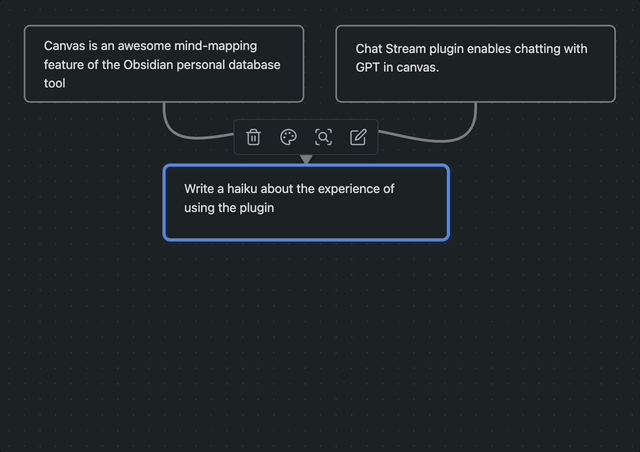

# Obsidian Chat Stream

An Obsidian plugin for conversing with GPT AI via canvas notes. Ancestor notes/files are included in the chat context.

## Install

### From BRAT

Add `rpggio/obsidian-chat-stream` to BRAT.
Note: you may need to re-open canvas documents after installation.

### Download Manually

Download the latest release. Extract and put the three files (main.js, manifest.json, styles.css) to
folder `{{obsidian_vault}}/.obsidian/plugins/rpggio/obsidian-chat-stream`.

## Usage

1. Select a note in the canvas
2. Press Shift+Command+Enter (Mac), or Shift+Win+Enter (Windows)
3. OpenAI chat AI will respond in a child note, using ancestors for context
4. Press Command+Enter to quickly create a normal text note

AI notes are colored purple, and tagged with `chat_role=assistant` in the canvas data file.

## Say thanks

If you love it you can send me a [coffee thumbs-up](https://bmc.link/ryanp) so I know folks find it useful.

