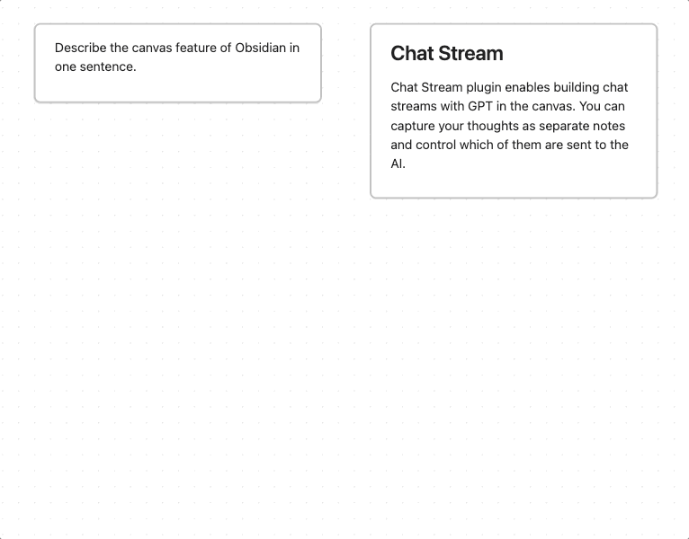

# Chat Stream 	🔀
 [](https://obsidian.md/plugins?search=chat%20stream)

An Obsidian plugin for conversing with GPT AI via canvas notes. Ancestor notes/files are included in the chat context. You can quickly create chat streams, and control what other notes are sent to the AI.



## Install

Install as [community plugin](https://obsidian.md/plugins?search=chat%20stream#)

Or, add `rpggio/obsidian-chat-stream` to [BRAT](https://github.com/TfTHacker/obsidian42-brat).

Chat Stream is supported only on desktop.

## Setup

Add an [OpenAI API key](https://platform.openai.com/account/api-keys) in Chat Stream settings.

## Usage

1. Select a note in the canvas
2. Press Alt+Shift+G to generate new note from GPT using current note + ancestors
3. To create next note for responding, press Alt+Shift+N.

AI notes are colored purple, and tagged with `chat_role=assistant` in the canvas data file.

## Development

1. Download source and install dependencies
   ```
	pnpm install
	```
2. In Obsidian, install and enable [hot reload plugin](https://github.com/pjeby/hot-reload)
3. Create symbolic link from this project dir to an Obsidian store 
   ```
	ln -s . your-obsidian-store/.obsidian/plugins/chat-stream
	```
4. Start dev server
	```
	pnpm run dev
	```
5. In Obsidian, enable Chat Stream Plugin and add OpenAI key in plugin settings.

Changes to code should automatically be loaded into Obsidian.

## Attribution

* Canvas plugin code from [Canvas MindMap](https://github.com/Quorafind/Obsidian-Canvas-MindMap)

## Say thanks

If you love it you can send me a [coffee thumbs-up](https://bmc.link/ryanp) so I know folks find it useful.

<a href="https://www.buymeacoffee.com/ryanp"></a>
